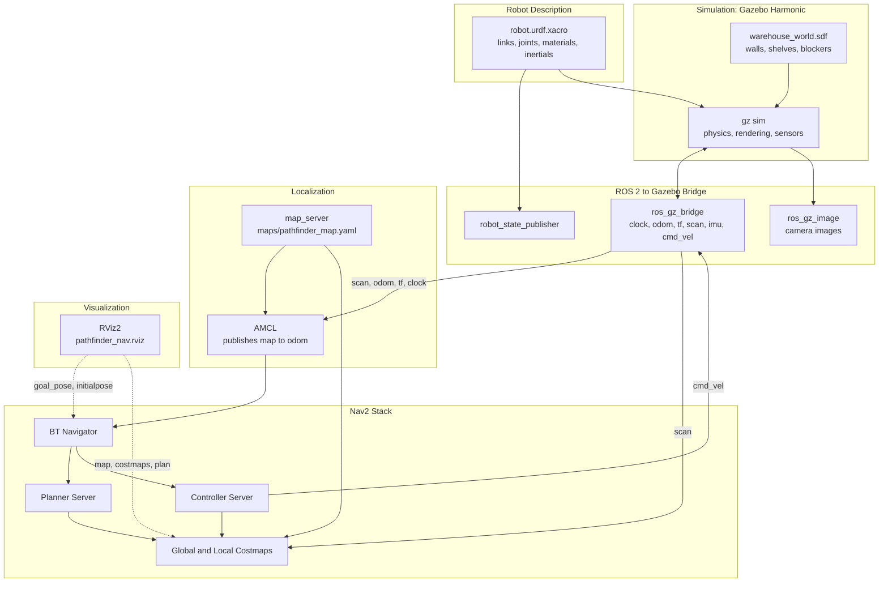
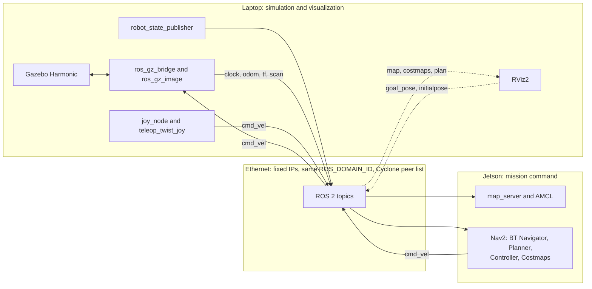

# Pathfinder Bot — Architecture

Describes the software architecture of `pathfinder_bot`: the ROS 2 / Gazebo stack, the Nav2 layer, and the two supported deployment modes.

| | |
|---|---|
| **OS** | Ubuntu 24.04 |
| **ROS 2** | Jazzy |
| **Simulator** | Gazebo Harmonic (`ros_gz_sim` / `ros_gz_bridge` / `ros_gz_image`) |
| **DDS** | Cyclone DDS (`rmw_cyclonedds_cpp`) |

---

## 0. Deployment modes

The project ships as a single ROS 2 package with two ways of running it. The launch files are identical in both modes; only where they run differs.

| | **v1: single device** | **v2: distributed (reference setup)** |
|---|---|---|
| Sim, bridges, robot_state_publisher | same machine | laptop |
| RViz | same machine | laptop |
| Nav2 + AMCL | same machine | Jetson |
| Entry point | `./startup.sh` | `distributed/startup_laptop.sh` and `distributed/startup_jetson.sh` |
| Extra setup | none | matching `ROS_DOMAIN_ID`, Cyclone peer XML, `use_sim_time` |
| Status | primary, tagged `v1.0` | documented reference for others, not a supported configuration |

**Why the split exists:** running Gazebo, RViz, and Nav2 together can overload a single laptop. v2 offloads the navigation stack to a second machine while keeping everything that touches Gazebo or renders camera data local to the simulator.

---

## 1. Software stack overview (v1)



### Layer descriptions

- **Robot Description**: `robot.urdf.xacro` and its includes (`links`, `joints`, `materials`, `inertial_macros`, plus the `gazebo_*.xacro` files) define Pathfinder's physical form: a differential-drive base, front and rear RGBD cameras, a 3D lidar, and an IMU. The TF tree is rooted at `base_link` (there is no `base_footprint`).
- **Simulation**: Gazebo Harmonic runs physics and sensor simulation against the custom warehouse world. Plugin names use the `gz-sim-*` / `gz::sim::systems::*` convention (the older `ignition` names from Fortress no longer apply).
- **ROS 2 ↔ Gazebo bridge**: `robot_state_publisher` publishes static TF from the URDF. `ros_gz_bridge` (configured by `gz_bridge.yaml`) and `ros_gz_image` translate Gazebo topics into ROS 2 topics. Topics that cross this boundary include `/clock`, `/odom`, `/tf`, `/scan`, `/imu`, `/joint_states`, `/cmd_vel`, and the camera streams.
- **Localization**: `map_server` serves the saved map (`maps/pathfinder_map.yaml` / `.pgm`, 0.05 m/px). AMCL matches live `/scan` data against it and publishes the `map → odom` transform. This replaces the earlier placeholder `static_transform_publisher`. `odom → base_link` comes from the DiffDrive plugin via the bridge.
- **Nav2 stack**: BT Navigator orchestrates the Planner Server (global path) and Controller Server (local obstacle avoidance) against shared costmaps, producing `/cmd_vel`. It is brought up by `launch/nav_bringup.launch.py`, which wraps `nav2_bringup`'s `bringup_launch.py`.
- **Mapping (offline, on demand)**: `slam_toolbox` was used once to build the map and is not part of the navigation runtime. To remap, run it with `config/mapper_params_online_async.yaml` and save a new map into `maps/`.
- **Visualization**: RViz2 with a single config, `rviz/pathfinder_nav.rviz` (Fixed Frame `map`, map, robot model, `/scan`, costmaps, planned path). It is used in both v1 and v2.

### Frame and parameter conventions

- Every Nav2 and SLAM base-frame parameter must be set to **`base_link`**. Nav2's defaults assume `base_footprint`, which does not exist in this TF tree (the same issue that affected `slam_toolbox`; see the Known Issues doc).
- Every nav-side node runs with `use_sim_time: true`. The clock comes from Gazebo through the `/clock` bridge.
- Footprint (in `base_link`): `[[0.4, 0.2], [0.4, -0.2], [-0.1, -0.2], [-0.1, 0.2]]`, derived from the chassis and wheel extents in the URDF.
- Speed ceiling: wheel radius 0.075 m and a joint velocity limit of 10 rad/s give about 0.75 m/s. Wheel separation is 0.35 m.

---

## 2. Distributed deployment (v2)

Sim and RViz stay on the laptop. Only the navigation stack moves to the Jetson.



### Role split

| Machine | Runs | Reasoning |
|---|---|---|
| **Laptop** | Gazebo, `ros_gz_bridge`, `ros_gz_image`, `robot_state_publisher`, RViz2, joystick and teleop | The bridge needs direct access to Gazebo's transport layer. RViz stays here so the camera images and point clouds never cross the network. Joystick nodes run wherever the joystick is plugged in. |
| **Jetson** | `map_server`, AMCL, full Nav2 stack (`nav_bringup.launch.py`) | Everything that only needs the bridged ROS 2 topics. |

The Jetson still builds the `pathfinder_bot` package, because Nav2 reads its params file and map from the package share directory. It never launches the sim, the bridge, or `robot_state_publisher`.

### Traffic crossing the network

| Direction | Topics |
|---|---|
| Laptop → Jetson | `/clock`, `/odom`, `/tf`, `/tf_static`, `/scan`, `/joint_states` (and `/robot_description` if needed) |
| Jetson → Laptop | `/cmd_vel`, `/map`, costmaps, `/plan`, `/tf` (`map → odom` from AMCL), lifecycle and action status |
| RViz (laptop) → Jetson | `/goal_pose`, `/initialpose` |

Not sent over the network: `/camera/*/image`, `/camera/*/depth_image`, `/camera/*/points`, `/scan/points`. Nothing on the Jetson consumes them, so they stay local to the laptop. This is the main reason RViz lives there.

### Network requirements

- Both machines have static Ethernet IPs:
  - Laptop: `<LAPTOP_STATIC_IP>`
  - Jetson: `<JETSON_STATIC_IP>`
- Same `ROS_DOMAIN_ID` on both. Nodes on different domain IDs never discover each other.
- Same `RMW_IMPLEMENTATION=rmw_cyclonedds_cpp` on both. Jazzy defaults to Fast DDS, so this must be set explicitly. Both machines set it via `distributed/env_laptop.sh` and `distributed/env_jetson.sh`, sourced by the startup scripts rather than relying on `~/.bashrc`. The shared addresses and domain ID live in `distributed/network.env`.
- **Discovery uses an explicit peer list, not multicast.** Both machines point `CYCLONEDDS_URI` at the same file, `distributed/cyclonedds.xml`, which lists both peer IPs and binds DDS to the Ethernet interface. This avoids the dependence on multicast behavior over a direct link.
- **Time:** every Jetson node runs with `use_sim_time:=true` and consumes `/clock` from the laptop. Wall-clock sync between the machines is not what matters here; sim time is.

### Open items to validate on hardware

- Whether AMCL and Nav2 run comfortably on the Jetson at the configured scan rate (the lidar is 20 Hz, 360 samples per scan).
- Latency of `/scan` and `/tf` over Ethernet and its effect on TF timeouts. Costmap and AMCL `transform_tolerance` may need raising.
- Confirm which Jetson model is used and record it in `distributed/README.md`. Ubuntu 24.04 is not an officially supported target for the original Jetson Nano.

---

## 3. Repository layout

```
pathfinder_bot/
├── CMakeLists.txt
├── package.xml
├── README.md                      # v1 quick start, links to distributed/
├── startup.sh                     # v1: sim + nav2 + rviz on one machine
│
├── description/                   # robot xacro files (Harmonic plugin names)
├── worlds/  models/  maps/
├── config/
│   ├── gz_bridge.yaml
│   ├── mapper_params_online_async.yaml
│   └── nav2_params.yaml
├── launch/
│   ├── launch_sim.launch.py       # Gazebo + bridges + robot_state_publisher
│   ├── nav_bringup.launch.py      # map_server + AMCL + Nav2
│   └── rsp.launch.py
├── rviz/
│   └── pathfinder_nav.rviz
│
├── docs/
│   ├── Architecture.md            # this document
│   └── Known_Issues_and_Workarounds.md
│
└── distributed/                   # v2 reference setup
    ├── README.md
    ├── network.env                # ROS_DOMAIN_ID and both IPs (edit on each machine)
    ├── env_common.sh
    ├── env_laptop.sh
    ├── env_jetson.sh
    ├── cyclonedds.xml             # peer list, shared by both machines
    ├── startup_laptop.sh          # launch_sim + rviz + joy/teleop
    ├── startup_jetson.sh          # nav_bringup only, waits for /clock
    └── check_link.sh              # verifies the link from either side
```

`distributed/` is documentation and scripts only. It is not in the `CMakeLists.txt` install list and does not affect the v1 build.

---

## 4. Status

**Done — both v1 and v2 fully working, confirmed end to end**
- Robot description, custom warehouse world, bridges, joystick teleop (including a Bluetooth controller fix — see Known Issues doc)
- Ported to Jazzy / Harmonic / Ubuntu 24.04 on both machines
- Map built with `slam_toolbox` and saved (`maps/pathfinder_map.*`, 606×493 px, about 30 m × 25 m)
- `nav2_params.yaml`, `nav_bringup.launch.py`, `pathfinder_nav.rviz` written; `startup.sh` updated for v1
- **v1 tested end to end:** localization, 2D Nav Goal, path planning, and obstacle avoidance — including obstacles added live in the sim that weren't on the original saved map
- **v2 (`distributed/`) built and tested end to end:** sim + RViz on the laptop, Nav2 + AMCL on the Jetson, goal sent and executed over the network link using an explicit Cyclone DDS peer list (no multicast)

**Remaining**
- Fill in the real Jetson model and static IPs in `distributed/README.md` / `network.env`
- Commit and tag `v1.0`, then the `distributed/` addition
- Fix the `git remote` URL typo (`pathfiner_bot` → `pathfinder_bot`) — currently redirected by GitHub, works but should be corrected
- Nav2 controller tuning beyond the current footprint and speed limits, if obstacle avoidance needs sharpening further
- Authentication or security on the ROS 2 link between machines (fine on a lab bench, worth revisiting before wider use)
- Screenshot or GIF of Gazebo + RViz (with Nav2 running) for the README
